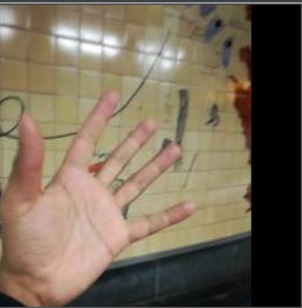
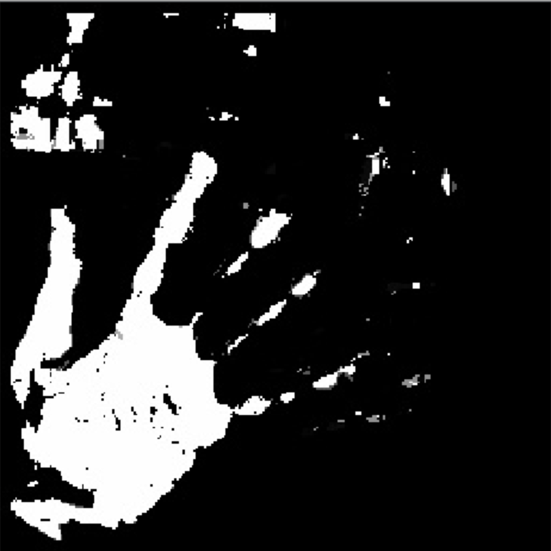

# Machine Learning - Image Segmentation

### Supported Learners

* Support Vector Machine

### Example Usage
python3 train.py -i hands/images -l hands/labels -c SVM -o model.p

python3 inference.py -i hands/images -m model.p -o hands/outputs

python3 evaluation.py -i hands/outputs -g hands/labels

### Example Input

### Example Output

### Source
The project code base was taken from https://github.com/dgriffiths3/ml_segmentation and then modified to work for our final project needs. 
