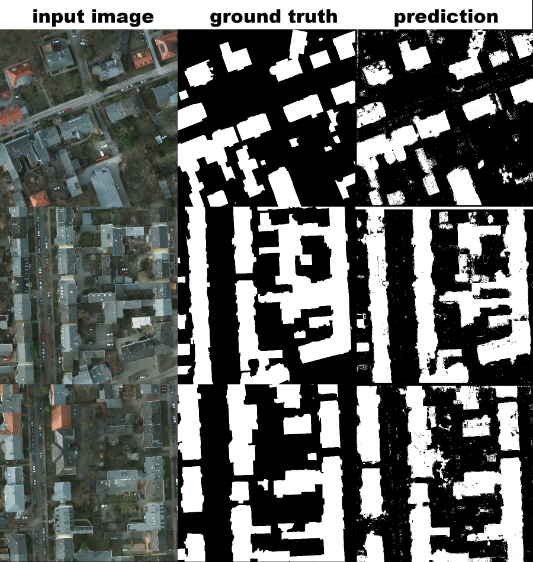

# Machine Learning - Image Segmentation

Per pixel image segmentation using machine learning algorithms. Programmed using the following libraries: Scikit-Learn, Scikit-Image OpenCV, and Mahotas and ProgressBar. Compatible with Python 2.7+ and 3.X.

### Feature vector

Spectral:

* Red
* Green
* Blue

Texture:

* Local binary pattern

Haralick (Co-occurance matrix) features (Also texture):

* Angular second moment
* Contrast
* Correlation
* Sum of Square: variance
* Inverse difference moment
* Sum average
* Sum variance
* Sum entropy
* Entropy

### Supported Learners

* Support Vector Machine
* Random Forest
* Gradient Boosting Classifier

### Example Usage
python3 train.py -i hands/images -l hands/labels -c SVM -o model.p

python3 inference.py -i hands/images -m model.p -o hands/outputs

python3 evaluation.py -i hands/outputs -g hands/labels

### Example Output

